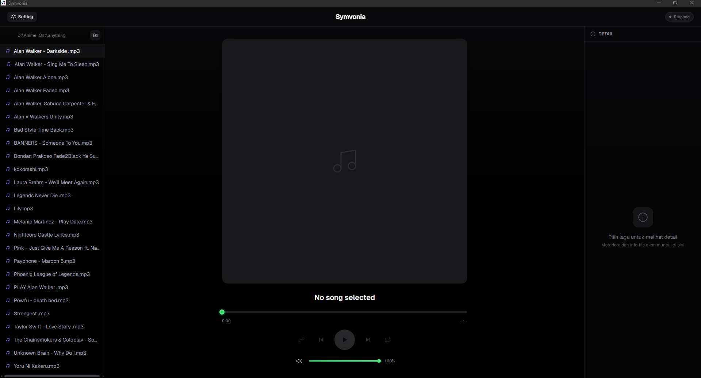
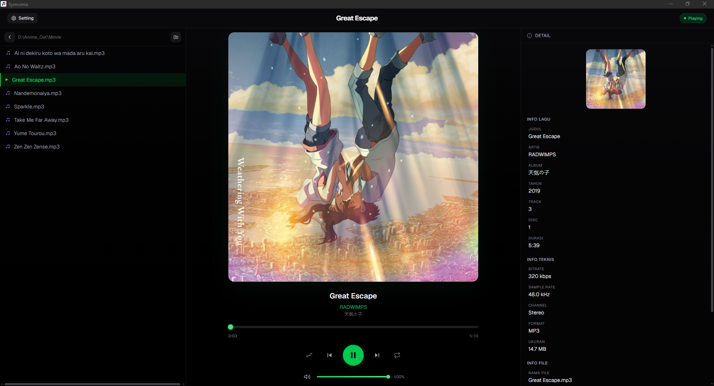
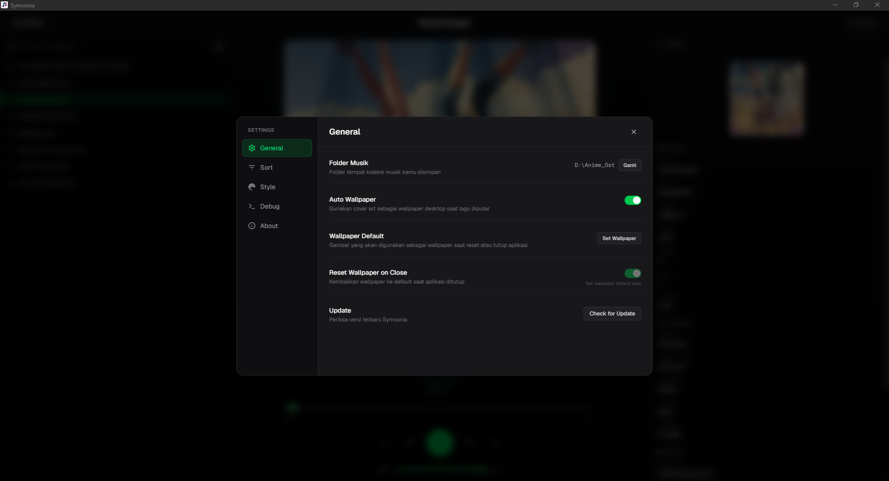

<p align="center">
  
</p>

# Symvonia — Desktop Music Player for Windows

**Symvonia** is a free, open-source desktop music player for Windows 
built with Tauri, Rust, and Next.js

<p align="center">
  
</p>

<p align="center">
  <a href="https://github.com/eszuri/symvonia/releases/latest">
    
  </a>
  <a href="https://github.com/eszuri/symvonia/blob/main/LICENSE">
    
  </a>
  <a href="https://github.com/eszuri/symvonia">
    
  </a>
</p>

---

## Tentang Symvonia

Symvonia adalah desktop music player untuk Windows yang dirancang untuk pecinta musik dengan koleksi file audio lokal. Berbeda dengan music player biasa, Symvonia memiliki fitur unik: **wallpaper desktop otomatis berubah mengikuti cover art lagu yang sedang diputar**.

Setiap lagu yang kamu putar akan mengubah tampilan desktop secara instan, menciptakan pengalaman mendengarkan musik yang lebih imersif dan personal.

---

## Fitur Utama

### Pemutaran Musik

- **Play, Pause, Next, Previous** — Kontrol dasar dengan respons instan
- **Shuffle** — Putar lagu secara acak dari playlist
- **Repeat** — Ulangi satu lagu, seluruh playlist, atau matikan
- **Auto-advance** — Otomatis pindah ke lagu berikutnya saat lagu selesai
- **Playlist persisten** — Navigasi ke folder lain tidak menghentikan playlist yang sedang berjalan

### Auto Wallpaper

Fitur unggulan Symvonia. Saat lagu diputar, cover art yang tertanam di file audio akan otomatis menjadi wallpaper desktop kamu.

- **Aktif/nonaktifkan** — Toggle di Settings jika tidak ingin wallpaper berubah
- **Default wallpaper** — Pilih gambar sendiri sebagai wallpaper saat lagu tanpa cover art atau saat aplikasi ditutup
- **Reset saat tutup** — Opsi kembalikan wallpaper ke default saat aplikasi ditutup, agar desktop kembali normal

### Eksplorasi File

- **Folder picker** — Pilih folder mana saja di komputer sebagai koleksi musik
- **Navigasi folder** — Masuk ke subfolder, kembali ke folder induk dengan mudah
- **Filter format** — Tampilkan hanya format yang kamu inginkan (MP3, FLAC, OGG, WAV, M4A, WMA, atau custom)
- **Sorting fleksibel** — Urutkan folder dan file berdasarkan nama, tanggal modifikasi, tanggal dibuat, ukuran, atau tipe file

### Info & Metadata

Panel detail di sisi kanan menampilkan informasi lengkap tentang lagu yang sedang diputar:

- **Info lagu** — Judul, artis, album, genre, tahun, nomor track, nomor disc
- **Info teknis** — Bitrate, sample rate, channel, durasi
- **Info file** — Nama file, ukuran, lokasi, tanggal dibuat dan dimodifikasi
- **Cover art** — Tampilan besar cover art yang tertanam di file audio
- **Komentar** — Menampilkan comment tag jika tersedia

### Keyboard Shortcuts

Kontrol musik tanpa menyentuh mouse:

| Tombol | Fungsi |
|--------|--------|
| `Space` | Play / Pause |
| `N` | Lagu berikutnya |
| `P` | Lagu sebelumnya |
| `→` | Volume naik |
| `←` | Volume turun |
| `F12` | Buka DevTools (debug) |

### Kustomisasi Tampilan

- **14 warna aksen** — Green, Blue, Purple, Pink, Red, Orange, Yellow, Teal, Cyan, Indigo, Rose, Lime, Amber, Emerald
- **Custom color** — Pilih warna aksen sendiri via color picker atau input hex
- **Dark theme** — Tampilan gelap yang nyaman di mata dengan efek blur dan animasi halus
- **Resizable layout** — Sidebar kiri dan panel kanan bisa di-drag untuk mengatur lebar sesuai preferensi
- **Compact mode** — Otomatis menyesuaikan saat window diperkecil, sidebar bisa di-toggle

### Settings

Semua preferensi tersimpan otomatis dan persisten:

- **General** — Folder musik, auto wallpaper, default wallpaper, reset on close, check for update
- **Sort** — Urutan folder dan file, arah urutan (ascending/descending)
- **Style** — Tema, warna aksen, reset lebar sidebar
- **Debug** — Log viewer untuk troubleshooting
- **About** — Info versi dan tech stack

### Auto Update

Symvonia bisa memeriksa dan menginstall update secara otomatis langsung dari aplikasi. Cukup klik **Check for Update** di Settings > General.

---

## Screenshots

<p align="center">
  
  
</p>

---

## Instalasi

### Installer (Windows)

Download file `.msi` atau `.exe` dari [Releases](https://github.com/eszuri/symvonia/releases/latest), lalu jalankan installer.

### Development

```bash
git clone https://github.com/eszuri/symvonia.git
cd symvonia
npm install
npm run tauri dev
```

### Build dari Source

```bash
npm run tauri build
```

Output installer ada di `src-tauri/target/release/bundle/`.

---

## Cara Penggunaan

1. **Buka Symvonia** — Aplikasi akan menampilkan halaman welcome
2. **Pilih folder musik** — Klik tombol "Pilih Folder Musik" dan pilih folder yang berisi koleksi audio kamu
3. **Putar lagu** — Double-click file audio dari daftar di sidebar kiri
4. **Nikmati** — Wallpaper desktop akan otomatis berubah mengikuti cover art lagu

---

## Tech Stack

| Layer       | Teknologi                                 |
| ----------- | ----------------------------------------- |
| Framework   | Next.js 16.2 (App Router, Static Export) |
| UI          | React 19.2, TypeScript 5                 |
| Styling     | Tailwind CSS v4                           |
| Animation   | Framer Motion 12.4                        |
| Desktop     | Tauri 2.11 (Rust)                         |
| Audio Meta  | Lofty 0.22                                |
| Image       | image 0.25                                |
| File Dialog | rfd 0.15                                  |
| Encoding    | base64 0.22                               |
| Ser/De      | serde 1.0 + serde_json                    |
| Updater     | tauri-plugin-updater 2                    |

---

## Struktur Proyek

```
├── app/
│   ├── layout.tsx
│   ├── page.tsx
│   ├── globals.css
│   ├── lib/
│   │   └── colors.ts            # Accent color system (14 preset + custom CSS vars)
│   └── components/
│       ├── ConfirmDialog.tsx     # Konfirmasi modal
│       ├── FolderExplorer.tsx    # Sidebar file tree (resizable)
│       ├── MetadataPanel.tsx     # Panel detail metadata (resizable)
│       ├── PlayerPanel.tsx       # Cover art + info lagu
│       ├── PlaybackControls.tsx  # Play/Prev/Next + Shuffle/Repeat toggle
│       ├── SeekBar.tsx           # Progress bar + time display
│       ├── SettingsModal.tsx     # Settings (5 sections)
│       └── VolumeControl.tsx     # Volume slider + mute
├── src-tauri/
│   ├── Cargo.toml
│   ├── tauri.conf.json
│   ├── capabilities/
│   │   └── default.json            # Permissions (core + updater)
│   ├── icons/
│   └── src/
│       ├── lib.rs                  # Tauri commands
│       └── main.rs                 # Entry point
├── public/
│   └── icon.png                    # App icon
├── screenshots/
│   ├── hero.png
│   ├── player.png
│   └── settings.png
├── next.config.ts
└── package.json
```

---

## Lisensi

MIT
