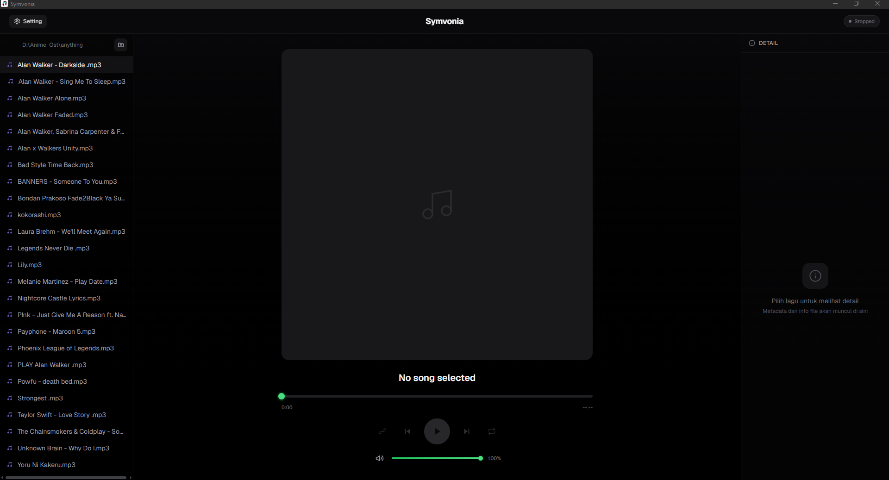
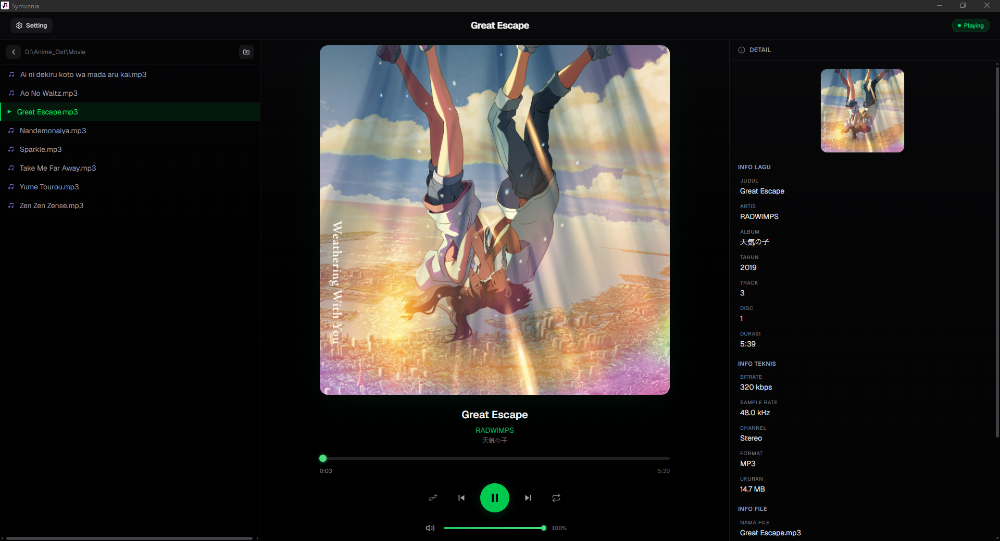
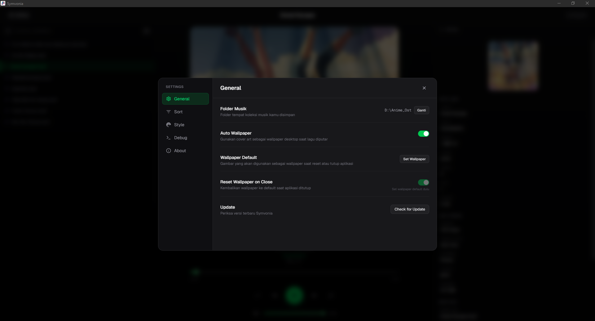

<p align="center">
  
</p>

<h1 align="center">Symvonia</h1>
<p align="center"><em>Desktop Music Player untuk Windows</em></p>

<p align="center">
  
</p>

<p align="center">
  <a href="https://github.com/eszuri/symvonia/releases/latest">
    
  </a>
  <a href="https://github.com/eszuri/symvonia/blob/main/LICENSE">
    
  </a>
  <a href="https://github.com/eszuri/symvonia">
    
  </a>
</p>

---

## Tentang Symvonia

Symvonia adalah desktop music player untuk Windows yang dirancang untuk pecinta musik dengan koleksi file audio lokal. Bedanya dari music player biasa, Symvonia bisa mengubah wallpaper desktop kamu secara otomatis mengikuti cover art lagu yang sedang diputar — menciptakan pengalaman mendengarkan yang lebih imersif.

Selain itu, Symvonia juga punya fitur **streaming web** terintegrasi, jadi kamu bisa buka YouTube Music, Spotify, SoundCloud, dan platform lainnya langsung dari dalam aplikasi tanpa perlu buka browser.

---

## Fitur Utama

### 🎵 Pemutaran Musik Lokal
Putar koleksi musik kamu dengan dukungan berbagai format (MP3, FLAC, OGG, WAV, M4A, WMA), lengkap dengan kontrol play, pause, next, previous, shuffle, repeat, dan playlist yang tetap berjalan walau kamu pindah folder.

### 🌐 Streaming Web Terintegrasi
Buka YouTube, YouTube Music, Spotify, SoundCloud, Apple Music, Bandcamp, Deezer, Tidal, atau URL media apapun langsung di jendela terpisah dalam aplikasi. Riwayat pemutaran tersimpan otomatis dan bisa dihapus kapan saja.

### 🖼️ Auto Wallpaper
Fitur paling khas Symvonia: setiap kali lagu diputar, cover art dari file audio langsung menjadi wallpaper desktop kamu. Bisa diatur agar wallpaper kembali normal saat aplikasi ditutup.

### 📁 Jelajahi Koleksi Musik
Pilih folder musik manapun di komputer kamu, navigasi dengan mudah antar subfolder, filter format file yang ditampilkan, dan urutkan berdasarkan nama, tanggal, ukuran, atau tipe file.

### ℹ️ Info Lagu Lengkap
Panel detail menampilkan judul, artis, album, genre, tahun, bitrate, sample rate, cover art, dan informasi teknis lainnya dari setiap lagu.

### ⌨️ Keyboard Shortcut
Kontrol pemutaran tanpa sentuh mouse — Space untuk play/pause, panah kiri/kanan untuk volume, dan shortcut lain yang bisa kamu kustomisasi sendiri.

### 🎨 Kustomisasi Tampilan
Pilih dari 14 warna aksen atau buat warna sendiri, layout sidebar yang bisa diatur lebarnya, dan mode kompak otomatis saat jendela dikecilkan.

### 🔄 Update Otomatis
Symvonia bisa memeriksa dan menginstall versi terbaru langsung dari dalam aplikasi, jadi kamu selalu dapat fitur terbaru tanpa repot.

---

## Screenshots

<p align="center">
  
  
</p>

---

## Cara Penggunaan

1. **Buka Symvonia** — Pilih folder musik kamu dari tombol "Pilih Folder Musik"
2. **Putar lagu** — Klik file audio dari daftar di sidebar kiri
3. **Streaming** (opsional) — Klik tombol **Streaming** di pojok kiri atas untuk membuka platform streaming
4. **Nikmati** — Wallpaper desktop akan berubah otomatis mengikuti cover art

---

## Instalasi

### Untuk Pengguna

**Persyaratan Sistem:**
- **OS:** Windows 10 1809+ (build 17763) atau Windows 11
- **WebView2 Runtime** — sudah terinstall bawaan di Windows 11 dan Windows 10 versi terbaru. Jika belum ada, akan otomatis terdownload saat instalasi
- **Ruang disk:** ~200 MB

Download installer `.msi` atau `.exe` dari [halaman Releases](https://github.com/eszuri/symvonia/releases/latest), jalankan, dan Symvonia siap digunakan.

### Untuk Developer

**Persyaratan Sistem:**
- **OS:** Windows 10 1809+ atau Windows 11
- **Node.js** ≥ 18.18
- **Rust toolchain** ≥ 1.77.2 (via [rustup](https://rustup.rs/))
- **Visual Studio 2022 Build Tools** — dengan workload "Desktop development with C++" (diperlukan oleh Tauri)
- **WebView2 Runtime** (sama seperti di atas)
- **Git**

```bash
git clone https://github.com/Eszuri/symvonia.git
cd symvonia
npm install
npm run tauri dev
```

---

## Lisensi

MIT
